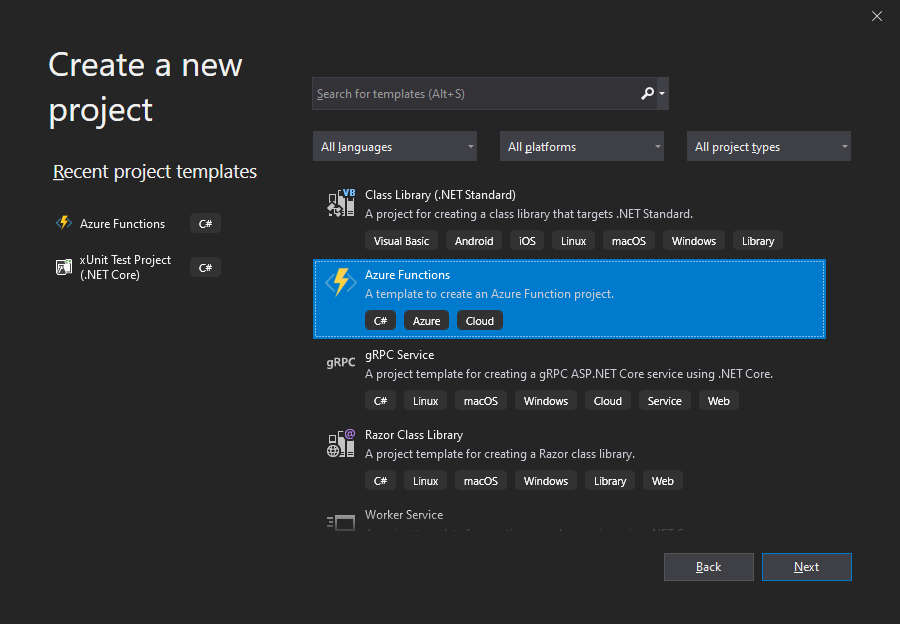

[](https://umamimolecule.visualstudio.com/azure-durablefunctions-management/_build/latest?definitionId=15&branchName=master) 

# azure-durablefunctions-management
Automatically adds HTTP endpoints to your Azure Durable Functions project to allow querying status of orchestration instances.

## NuGet Package

https://www.nuget.org/packages/Umamimolecule.AzureDurableFunctions.Management/

## Installation

Select your Durable Functions project and run the following command in the Package Manager console:
```
install-package Umamimolecule.AzureDurableFunctions.Management
```

## Motivation

Provide an out-of-the-box set of management functions without having to write them for each Durable Functions project.

When you add this package to your Azure Functions project, you'll automatically get the following endpoints to allow orchestration instance management:


The endpoints are located at `/{routeRoute}/orchestration/instances` (this will be `/api/orchestration/instances` unless you have overridden the default route prefix).

## Documentation

[See here](docs/documentation.md) for documentation of all the endpoints.

## Tutorial

Let's create a durable function project and add the management package so we can see how it works.

What you'll need:
 - Visual Studio (For this tutorial I'm using VS 2019)
 - Postman or a similar tool to issue GET and POST requests. [Here is a Postman collection](tools/DurableFunctions%20Instance%20Management.postman_collection.json) you may find useful as it contains all of the endpoints with the query parameters set up.

### 1. Create a new Azure Functions project



Give your application a name and location to save.


Note: At the time of writing, I'm using version `1.0.29` of the `Microsoft.NET.Sdk.Functions` package.

### 2. Add Microsoft.Azure.WebJobs.Extensions.DurableTask package

Open the Package Manager Console window and type the following command:
```
install-package Microsoft.Azure.WebJobs.Extensions.DurableTask
```

Alternatively, open the menu **Tools** -> **NuGet Packager Manager** -> **Manage NuGet packages for solution** and search for ***Microsoft.Azure.WebJobs.Extensions.DurableTask***.

At the time of writing, I'm using version `2.1.0` of the `Microsoft.Azure.WebJobs.Extensions.DurableTask` package.

### 3. Add Umamimolecule.AzureDurableFunctions.Management package

Open the Package Manager Console window and type the following command:
```
install-package Umamimolecule.AzureDurableFunctions.Management
```

Alternatively, open the menu **Tools** -> **NuGet Packager Manager** -> **Manage NuGet packages for solution** and search for ***Umamimolecule.AzureDurableFunctions.Management***.

At this point, press F5 to build and run the Azure function locally.  You should see the following output on the console window:


### 4. Create a HTTP-triggered durable function

We'll create a HTTP-triggered durable function that doesn't do much apart from wait for a period of time and then completes successfully.  It doesn't sound terribly useful, but we'll use it to demonstrate some of the management endpoints.

a. Replace the contents of the `Function1.cs` file with the following code:
```
using System.Threading.Tasks;
using Microsoft.AspNetCore.Http;
using Microsoft.AspNetCore.Mvc;
using Microsoft.Azure.WebJobs;
using Microsoft.Azure.WebJobs.Extensions.DurableTask;
using Microsoft.Azure.WebJobs.Extensions.Http;

namespace DurableFunctionsTest1
{
    public class Function1
    {
        [FunctionName("Function1")]
        public async Task<IActionResult> Run(
            [HttpTrigger(AuthorizationLevel.Anonymous, "get")]HttpRequest req,
            [DurableClient]IDurableClient orchestratorClient)
        {
            var instanceId = await orchestratorClient.StartNewAsync("MyOrchestrator");
            return orchestratorClient.CreateCheckStatusResponse(req, instanceId);
        }
    }
}
```

b. Right-click the project and click **Add** -> **Class** and then set filename as `MyOrchestrator.cs`.  Click **OK**.  Replace the contents of the file with the following code:
```
using System.Threading.Tasks;
using Microsoft.Azure.WebJobs;
using Microsoft.Azure.WebJobs.Extensions.DurableTask;

namespace DurableFunctionsTest1
{
    public class MyOrchestrator
    {
        [FunctionName("MyOrchestrator")]
        public async Task<string> Run(
            [OrchestrationTrigger]IDurableOrchestrationContext context)
        {
            var result = await context.CallActivityAsync<string>(
                "PauseActivity",
                null);

            return result;
        }
    }
}
```

c. Right-click the project and click **Add** -> **Class** and then set filename as `PauseActivity.cs`.  Click **OK**.  Replace the contents of the file with the following code:
```
using System.Threading;
using Microsoft.Azure.WebJobs;
using Microsoft.Azure.WebJobs.Extensions.DurableTask;
using Microsoft.Extensions.Logging;

namespace DurableFunctionsTest1
{
    public class PauseActivity
    {
        [FunctionName("PauseActivity")]
        public string Run(
            [ActivityTrigger] IDurableActivityContext activityContext,
            ILogger logger)
        {
            logger.Log(
                LogLevel.Information,
                $"PauseActivity called with instanceId = {activityContext.InstanceId}");

            Thread.Sleep(30000);

            return "Done";
        }
    }
}
```

### 5. Trigger the durable function

Run the project by pressing F5, then execute the following GET request in Postman:
```
http://localhost:7071/api/orchestration/instances
```

The durable function should trigger and produce output similar to the following:
```
{
    "id": "03517277886f4e2988d0b63627b994dc",
    "statusQueryGetUri": "http://localhost:7071/runtime/webhooks/durabletask/instances/03517277886f4e2988d0b63627b994dc?taskHub=TestHubName&connection=Storage&code=4sadQTmb9Qf/GurOa34FdMTfcYA/o1Xgac6A5WhdrF7198XMDL9P7A==",
    "sendEventPostUri": "http://localhost:7071/runtime/webhooks/durabletask/instances/03517277886f4e2988d0b63627b994dc/raiseEvent/{eventName}?taskHub=TestHubName&connection=Storage&code=4sadQTmb9Qf/GurOa34FdMTfcYA/o1Xgac6A5WhdrF7198XMDL9P7A==",
    "terminatePostUri": "http://localhost:7071/runtime/webhooks/durabletask/instances/03517277886f4e2988d0b63627b994dc/terminate?reason={text}&taskHub=TestHubName&connection=Storage&code=4sadQTmb9Qf/GurOa34FdMTfcYA/o1Xgac6A5WhdrF7198XMDL9P7A==",
    "purgeHistoryDeleteUri": "http://localhost:7071/runtime/webhooks/durabletask/instances/03517277886f4e2988d0b63627b994dc?taskHub=TestHubName&connection=Storage&code=4sadQTmb9Qf/GurOa34FdMTfcYA/o1Xgac6A5WhdrF7198XMDL9P7A=="
}
```
After 10 seconds the activity will complete.

### 6. Use the management endpoints

Now we can start using the management endpoints in our Azure function to query the status of the instance.

a. Issue the following GET request in Postman:
```
http://localhost:7071/api/orchestration/instances
```
This should produce a response similar to the following:
```
{
    "durableOrchestrationState": [
        {
            "name": "MyOrchestrator",
            "instanceId": "03517277886f4e2988d0b63627b994dc",
            "createdTime": "2019-12-24T12:16:04.4882956Z",
            "lastUpdatedTime": "2019-12-24T12:16:15.2762312Z",
            "input": null,
            "output": "Done",
            "runtimeStatus": "Completed",
            "customStatus": null,
            "history": null
        }
    ],
    "continuationToken": null
}
```
Lets now purge the history for this instance by issuing the following POST request in Postman:
```
http://localhost:7071/api/orchestration/instances/03517277886f4e2988d0b63627b994dc/purgeInstanceHistory
```
Make sure to replace the ID above with the actual value for your instance.  Now run this GET query again:
```
http://localhost:7071/api/orchestration/instances
```
And observe that the history has now been deleted:
```
{
    "durableOrchestrationState": [],
    "continuationToken": null
}
```
